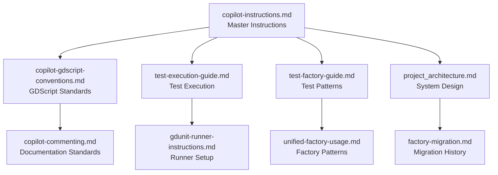

# AI Documentation Index - Grid Building Plugin

This is the master index for all AI assistant documentation for the Grid Building Plugin project. All documents are organized by category to help AI assistants find relevant information quickly.

## Project-Specific Documentation

Located in [`docs/project/`](docs/project/):

### Core Project Guidelines

- **[copilot-instructions.md](copilot-instructions.md)** - Master instruction file with project conventions, testing patterns, and system integration guides
- **[project_architecture.md](docs/project/project_architecture.md)** - Grid Building Plugin architecture, system dependencies, and integration patterns
- **[factory-migration.md](docs/project/factory-migration.md)** - Migration summaries and factory pattern evolution
- **[github_issues_notes.md](docs/project/github_issues_notes.md)** - GitHub Issues usage notes and pitfalls

### Test Factory Documentation

- **[test-factory-guide.md](docs/project/test_factory_guide.md)** - Comprehensive guide for test object creation using factory patterns
- **[UNIFIED_FACTORY_USAGE_GUIDE.md](../test/grid_building_test/UNIFIED_FACTORY_USAGE_GUIDE.md)** - Unified factory usage patterns and best practices

## Godot & GdScript Documentation

**Generic Standards (Submodule):** [ct_gdscript_practices/](ct_gdscript_practices/)

### Language Conventions

- **[copilot-gdscript-conventions.md](copilot-gdscript-conventions.md)** - Project-specific GDScript coding standards and dependency injection patterns
- **[ct_gdscript_practices/gdscript-conventions.md](ct_gdscript_practices/gdscript-conventions.md)** - Generic GDScript conventions (reusable across projects)
- **[gdunit_testing_patterns.md](../test/grid_building_test/docs/gdunit_testing_patterns.md)** - GdUnit4 testing patterns (project-focused)
- **[ct_gdscript_practices/godot-project-standards.md](ct_gdscript_practices/godot-project-standards.md)** - General Godot project organization standards
- **[ct_gdscript_practices/theme_editing_best_practices.md](ct_gdscript_practices/theme_editing_best_practices.md)** - Theme editing best practices (generic)

## Testing Documentation

Located in [`docs/testing/`](docs/testing/):

### Test Execution

- **[test_execution_guide.md](docs/testing/test_execution_guide.md)** - Comprehensive test execution instructions for AI assistants
- **[gdunit_runner_instructions.md](../test/grid_building_test/docs/gdunit_runner_instructions.md)** - GdUnit4 test runner setup and usage instructions

### Test Development

- **[test_development_patterns.md](docs/testing/test_development_patterns.md)** - Testing patterns, parameterization, and cleanup best practices

## Quick Reference for AI Assistants

### Primary Entry Points

1. **[copilot-instructions.md](copilot-instructions.md)** - Start here for all project work
2. **[copilot-gdscript-conventions.md](copilot-gdscript-conventions.md)** - For GDScript-specific questions
3. **[test_execution_guide.md](docs/testing/test_execution_guide.md)** - For running and debugging tests

### Common Tasks

- **New test creation:** Follow [test-factory-guide.md](docs/project/test_factory_guide.md)
- **GDScript coding:** Reference [copilot-gdscript-conventions.md](copilot-gdscript-conventions.md)
- **Test execution issues:** Check [test_execution_guide.md](docs/testing/test_execution_guide.md)
- **Project architecture questions:** See [project_architecture.md](docs/project/project_architecture.md)

## Document Relationships

## Notes for AI Assistants

- **Primary Reference:** Always start with `copilot-instructions.md` for project-wide guidance
- **Language-Specific:** Use `copilot-gdscript-conventions.md` for GDScript coding questions
- **Testing:** Reference appropriate testing documents when working with tests
- **Cross-References:** Documents link to each other where relevant - follow the links for deeper context
- **Updates:** When updating project patterns, ensure all related documents are updated consistently

## Recent Cleanup (2025-08-07)

- Streamlined copilot-instructions.md: Removed duplicate testing information now in dedicated docs
- Removed outdated files: Cleaned up empty factory guides and migration summaries
- Consolidated debug tests: Removed duplicate debug test files in wrong locations
- Consistent cross-references: All documents now properly link to each other

---

Last updated: August 7, 2025
